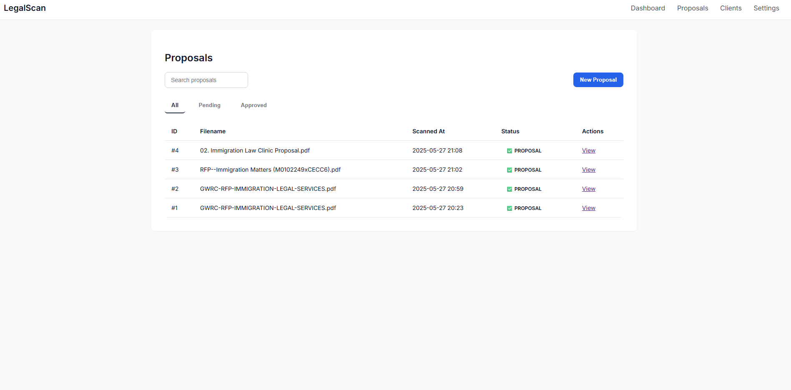

# 🧠 LegalScan – AI-Powered Proposal Classifier

LegalScan is a full-stack intelligent web app that classifies uploaded documents as formal **proposals** or **non-proposals**, using a hybrid of **vector similarity (FAISS)**, **heuristic rules**, and **LLM-based summarization**. Built for legal professionals.



---

## ⚙️ Features

- 🔍 **Proposal Classification**  
  Uses FAISS and keyword-based heuristics to classify documents as `PROPOSAL`, `MAYBE_PROPOSAL`, or `NON_PROPOSAL`.

- 📋 **LLM Summarization**  
  Generates concise summaries of documents labeled as proposals.

- 📊 **Rule Breakdown Display**  
  Explains scoring based on headers, keyword presence, structure, and submission terms.

- 🗂 **Historical Dashboard**  
  Scanned documents are saved in a local database and accessible via a searchable UI.

- ☁️ **Hybrid OCR Support**  
  Choose between local Tesseract OCR or AWS Textract for PDF/image parsing.

- 🛡️ **Secure, Modular Design**  
  Environment-controlled secrets, RESTful architecture, SQLite or PostgreSQL-ready.

---

## 🧪 Example Use Case

> Upload a government PDF. The app will:
> 1. Extract text (local or cloud).
> 2. Predict if it's a proposal.
> 3. Show a summary and rule score.
> 4. Log results to a dashboard for future reference.

---

## 🚀 Quick Start

### 1. Clone & Install

```bash
git clone https://github.com/your-username/legal-scan.git
cd legal-scan/backend
python -m venv venv
source venv/bin/activate  # or venv\Scripts\activate on Windows
pip install -r requirements.txt
```

### 2. Configure `.env`

```env
FLASK_SECRET_KEY=your-secret-key
AWS_ACCESS_KEY_ID=your-aws-key
AWS_SECRET_ACCESS_KEY=your-aws-secret
AWS_REGION=us-east-1
S3_BUCKET_NAME=your-textract-bucket
```

### 3. Run the App

```bash
python app.py
```

Visit: `http://localhost:5000`

---

## 🧠 Classifier Logic

Each prediction is determined by:

* **Vector similarity score** (FAISS-trained embeddings)
* **Rule-based boosters**:
  * ✅ Header match (`Request for Proposal`, etc.)
  * ✅ Keyword density (budget, deliverables, etc.)
  * ✅ Structured sections (e.g., "Scope of Work", "Evaluation")
  * ✅ Submission language ("submit by", "deadline", etc.)

---

## 🗃 Tech Stack

| Layer      | Stack                                 |
| ---------- | ------------------------------------- |
| Backend    | Flask, SQLAlchemy                     |
| Frontend   | Jinja2 + HTML/CSS                     |
| OCR        | Tesseract (local) + AWS Textract (S3) |
| Classifier | FAISS + Regex Heuristics              |
| Summary    | LLM via Ollama/OpenAI/HuggingFace     |
| Storage    | SQLite (default)                      |

---

## 📂 Directory Overview

```
backend/
├── app.py                  # Flask app entry
├── models.py               # SQLAlchemy model
├── templates/              # Jinja2 templates
├── static/                 # CSS & assets
├── faiss_utils.py          # Vector search classifier
├── ocr_utils.py            # Local Tesseract extraction
├── textract_s3_utils.py    # AWS Textract integration
├── llm_utils.py            # LLM summary agent
├── qualifier_rules.py      # Heuristic rule scoring
```

---

## ✅ Sample Output

```
Prediction: ✅ PROPOSAL (confidence: 0.87)
Matched Rules:
  - keywords: ✅
  - header: ✅
  - structure: ✅
  - submission: ❌

Summary:
This RFP outlines requirements for immigration legal services...
```

---

## 🧠 Why It Stands Out

* Combines **NLP**, **LLMs**, and **classic AI** for explainable document classification
* Modular, production-ready codebase suitable for **legal tech**, **GovTech**, and **AI/ML portfolios**
* UX designed around **decision making**, not just classification

---